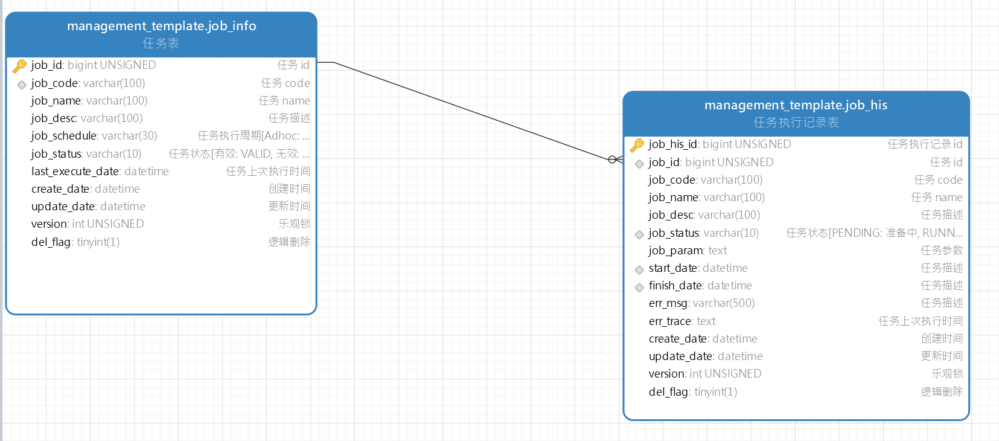
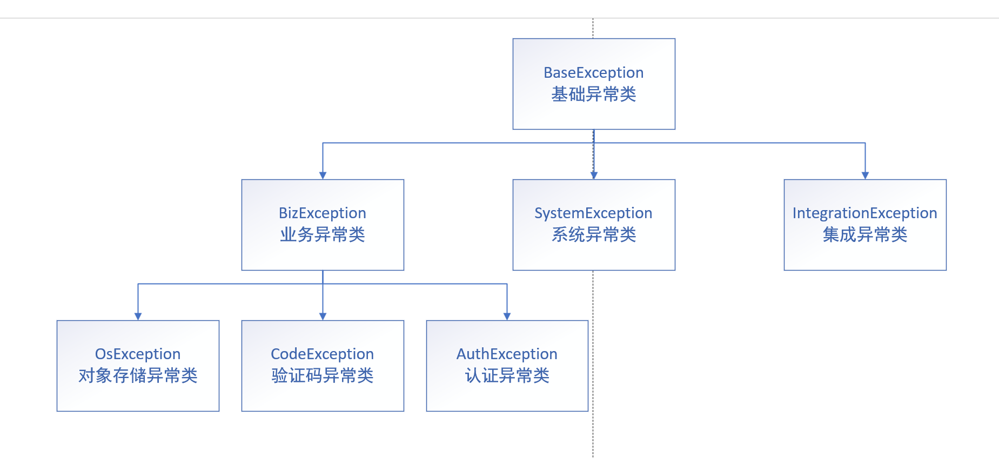

# ManagementSystemTemplate -- 管理系统模板(后端)

## 技术栈

- SpringBoot
- Mybatis & Mybatis Plus
- Spring doc & Swagger UI
- Redis
- MySQL & Oracle

## 模板实现功能

- [x] job 管理
- [x] 登录认证
- [x] 用户-角色-权限管理
- [x] 邮件发送
- [x] 短信发送
- [x] 验证码, 二维码生成
- [x] 文件管理
- [x] 文件管理多数据源支持(阿里云, 七牛云, 腾讯云, SM.MS, Local, DB)
- [x] Docker 构建, 包含环境&服务
- [x] Jenkins 构建

## 模块详情

### 登录认证实现


### Job 实现

> 简介

Job 模块主要用于实现管理项目的定时任务, 手动任务

Job 主要分为两类
- 定时 Job: 定时执行的 Job
- 手动 Job: 需手动执行的 Job, 此类 Job 也可以通过注解设定, 在项目启动后自动执行一次, 具体实现可参考 [InitializeRoleJob](src/main/java/com/yixihan/template/job/InitializeRoleJob.java)

> 相关表

- job_info: 记录 Job 的基础信息
- job_his: 记录 Job 的执行记录



> 相关类

- 接口 `Job` ([Job](src/main/java/com/yixihan/template/job/Job.java)): **用于定义 Job**, 共有如下几个方法
```java
// basic job info
String jobCode();
String jobName();
String jobDescription();
// job 执行周期, 文字化描述, 手动触发则置为 Manually
String jobSchedule();
// job 触发器, 此方法上写 定时注解. 代码则固定调用 JobRunner.runJob 方法
void execute();
// job 执行具体逻辑
void run(JobParam param);
```
- Job 执行入参 `JobParam` ([JobParam.java](src/main/java/com/yixihan/template/vo/req/job/JobParam.java)):  **用于定义 Job 执行参数**, 共有如下几个参数
```java
// 任务 code
private String jobCode;
// 任务执行时间
private Date jobExecuteDate;
// 其余参数, json 格式
private String details;
```
- 执行器 `JobRunner` ([JobRunner](src/main/java/com/yixihan/template/job/JobRunner.java)):  **用于执行 Job**, 共有如下几个方法
```java
// 执行 job, 不带 jobParam, 没有 job 执行参数的走这个方法
public void runJob(Job job);
// 执行 job, 带 jobParam, 有 job 执行参数的走这个方法, 走接口手动触发 job 也是走的这个方法
public void runJob(Job job, JobParam param);
```
- Job 状态枚举 `CommonStatusEnums` ([CommonStatusEnums](src/main/java/com/yixihan/template/common/enums/CommonStatusEnums.java)): **用于定义 Job 的状态**
- Job 执行结果枚举 `JobStatusEnums` ([JobStatusEnums](src/main/java/com/yixihan/template/common/enums/JobStatusEnums.java)): **用于定义 Job 的执行结果**
- JobHis 自动清理 Job `AutoCleanJobHisJob` ([AutoCleanJobHisJob](src/main/java/com/yixihan/template/job/AutoCleanJobHisJob.java)): **用于清理过于久远或过多的 Job 执行记录**
   - 超过 180 天的 JobHis
   - 单个 Job 执行记录超过 1w 条的 JobHis, 清理至 1w 条


#### Job 执行过程实现

首先需要明白. 无论哪类 Job, 触发 Trigger 是什么, 最终都会通过 `JobRunner.runJob` 去执行. 
1. Job 触发
   1. 手动触发: 触发方法为 `com.yixihan.template.service.job.impl.JobInfoServiceImpl.triggerJob` 方法, 该方法为手动调用, 经参数校验后, 获取 `Job` 类后直接调用 `JobRunner.runJob`
   2. 自动触发: 触发方法为 `com.yixihan.template.job.Job.execute` 方法. 该方法通过 `@Scheduled` 注解自动调用, 直接调用 `JobRunner.runJob`
2. 获取 `jobInfo` & 初始化 `jobHis`
   1. 首先通过 `Job.jobCode` 方法获取 `jobCode`, 然后去数据库里面 load `jobInfo`. 参考 `com.yixihan.template.job.JobRunner.getJobInfo`
      1. 若数据库中没有该 `jobCode`, 则会通过 `Job` 对象里面的信息, 初始化一个 `JobInfo` 对象, 然后入库
      2. 若数据库中有该 `jobCode`, 则直接从数据库中 load 该 `JobInfo`
      3. 判断该 `JobInfo` 的状态, 若为 Invalid, 则直接结束该 `Job` 的执行
   2. 然后通过 `JobInfo` 去初始化 `JobHis` 对象, 入库. 参考 `com.yixihan.template.job.JobRunner.initJobHis`
3. 设置该 Job 这一次触发的开始时间, 然后更新 `JobInfo` 和 `JobHis`
4. 调用 `Job.run` 方法去实际执行该 Job 的具体逻辑
5. 若 Job 执行成功, 更新 `JobHis` 的 `finishDate` & `jobStatus`, 最后入库
6. 若 Job 执行失败, 更新 `JobHis` 的 `jobStatus` & `errMsg` & `errTrace`, 最后入库

### 异常实现

系统所有自定义异常均基于 `BaseException` ([BaseException](src/main/java/com/yixihan/template/common/exception/BaseException.java))

异常主要分为四个大块
- 异常类: 自定义异常类, 自定义异常顶级类为 `BaseException`
- 异常枚举: 自定义异常枚举, 需要有 `errCode`, `message`, 实现在 `ExceptionEnums` ([ExceptionEnums](src/main/java/com/yixihan/template/common/enums/ExceptionEnums.java))
- 异常捕获器: api 异常捕获器, 用于捕获执行 api 时抛出的异常, 包装成 `ApiResp` 类, 用于前端解析, 实现在 `GlobalExceptionHandler` ([GlobalExceptionHandler](src/main/java/com/yixihan/template/handler/GlobalExceptionHandler.java))
- 异常工具类:
   - `Panic` ([Panic](src/main/java/com/yixihan/template/common/util/Panic.java)): 异常抛出工具, 用于定义一些常见的异常抛出情况
   - `Assert` ([Assert](src/main/java/com/yixihan/template/common/util/Assert.java)): 断言类, 常用于参数校验


#### 异常类详解
> 异常类关系图


ps: 图中的 `SystemException`, `IntegrationException` 并未实现, 只是举个例子

- `BaseException` ([BaseException](src/main/java/com/yixihan/template/common/exception/BaseException.java)) 是所有自定义异常的父类
- `BizException` ([BizException](src/main/java/com/yixihan/template/common/exception/BizException.java)) 是所有业务异常的父类
- 自己自定义的类可以根据实际涵义安放, 比如 `SystemException` 就可以和 `BizException` 平级
- 异常类应均实现四个构造函数
```java
// 默认无参构造方法, 传入该异常类最顶级的异常枚举值
public CodeException() {
    super(ExceptionEnums.CODE_VALIDATE_ERROR);
}
// 带异常消息的构造方法
public CodeException(String message) {
    super(message);
}
// 带 Throwable 的构造方法
public CodeException(Throwable e) {
    super(e);
}
// 带异常枚举值的构造方法, 用于自定义异常枚举
public CodeException(ExceptionEnums enums) {
    super(enums);
}
```

#### 异常枚举详解

异常枚举是用于定义一些常见的异常情况, 如验证码过期, 无访问权限等异常. 主要包含两个字段
- `errCode`: 异常 code
- `message`: 异常描述

可自己实现异常枚举, 参考现有的异常枚举即可

#### 异常工具类详解

> Assert

断言工具, 常用于参数校验, 继承自 hutool 的 `Assert`, 同时重写了部分断言, 用于抛出自定义类

> Panic

异常抛出工具, 用于抛出异常, 实现了一些常用的异常抛出情况, 后续可自行实现

#### 异常捕获器详解

通过 Spring 提供的 `@ControllerAdvice` 注解实现, 捕获了所有的自定义异常以及常见的 Java 异常, 可自己重写其异常包装逻辑

原理自己搜索即可

### 常用类介绍

主要介绍如下几个包下面的类
- config
- utils

#### 工具类介绍

- `AppContext` ([AppContext](src/main/java/com/yixihan/template/common/util/AppContext.java)): 应用程序上下文, 通过 `ThreadLocal` 实现, 能获取当前上下文设置的信息, 目前其内仅有 `AuthVO` 字段, 后续可自行添加其他常用的字段
- `Assert` ([Assert](src/main/java/com/yixihan/template/common/util/Assert.java)): 断言工具
- `EnvUtil` ([EnvUtil](src/main/java/com/yixihan/template/common/util/EnvUtil.java)): 环境工具, 能获取当前运行的环境, 用于不同环境逻辑不同的情况
- `FileUtil` ([FileUtil](src/main/java/com/yixihan/template/common/util/FileUtil.java)): 文件工具, 继承自 hutool 的 `FileUtil`, 并自定义实现了部分方法, 可参考 method doc
- `JwtUtil` ([JwtUtil](src/main/java/com/yixihan/template/common/util/JwtUtil.java)): Jwt 工具, 使用 hutool jwt 实现, 用于生成, 解析, 校验 jwt
- `MD5Util` ([MD5Util](src/main/java/com/yixihan/template/common/util/MD5Util.java)): MD5 工具, 用于用户密码加密
- `PageUtil` ([PageUtil](src/main/java/com/yixihan/template/common/util/PageUtil.java)): 分页工具, 用于实现自定义分页查询
- `Panic` ([Panic](src/main/java/com/yixihan/template/common/util/Panic.java)): 异常抛出工具
- `UserUtil` ([UserUtil](src/main/java/com/yixihan/template/common/util/UserUtil.java)): 用户工具, 用于获取登录用户信息
- `ValidationUtil` ([ValidationUtil](src/main/java/com/yixihan/template/common/util/ValidationUtil.java)): 正则校验工具

#### 配置类介绍

- `AuthConfig` [AuthConfig](src/main/java/com/yixihan/template/config/auth/AuthConfig.java): 权限认证配置, 定义了 白名单列表, API 包
- `CacheConfig` ([CacheConfig](src/main/java/com/yixihan/template/config/cache/CacheConfig.java)): 缓存参数配置, Spring Cache 的配置, 定义了参数缓存信息, 包含 cache key, cache 过期时间
- `CacheManageConfig` ([CacheManageConfig](src/main/java/com/yixihan/template/config/cache/CacheManageConfig.java)): 缓存管理配置, Spring Cache 的配置, 自定义了 Redis key 的过期时间逻辑
- `RedisConfig` ([RedisConfig](src/main/java/com/yixihan/template/config/cache/RedisConfig.java)): Redis 缓存序列化配置, 自定义了 Redis 的序列化方式
- `OsClientConfig` ([OsClientConfig](src/main/java/com/yixihan/template/config/os/OsClientConfig.java)): 对象存储 Client 配置, 实现了几个常用对象存储云服务商的 OSClient 简单自动注入
- `CodeConfig` ([CodeConfig](src/main/java/com/yixihan/template/config/third/CodeConfig.java)): 验证码配置
- `EmailConfig` ([EmailConfig](src/main/java/com/yixihan/template/config/third/EmailConfig.java)): 邮箱配置
- `OsConfig` ([OsConfig](src/main/java/com/yixihan/template/config/third/OsConfig.java)): 对象存储配置
- `SmsConfig` ([SmsConfig](src/main/java/com/yixihan/template/config/third/SmsConfig.java)): 短信配置
- `CorsConfig` ([CorsConfig](src/main/java/com/yixihan/template/config/CorsConfig.java)): 跨域配置
- `DatasourceConfig` ([DatasourceConfig](src/main/java/com/yixihan/template/config/DatasourceConfig.java)): 数据库连接池配置, 使用 `HikariDataSource`
- `MybatisPlusConfig` ([MybatisPlusConfig](src/main/java/com/yixihan/template/config/MybatisPlusConfig.java)): MybatisPlus 插件配置
- `MyMetaObjectHandler` ([MyMetaObjectHandler](src/main/java/com/yixihan/template/config/MyMetaObjectHandler.java)): MybatisPlus 自动注入配置, `createDate` 和 `updateDate` 的默认值插入
- `SpringDocConfig` ([SpringDocConfig](src/main/java/com/yixihan/template/config/SpringDocConfig.java)): SpringDoc 配置, 类似于 Swagger 的配置, 用于配置 Api doc 的基础信息