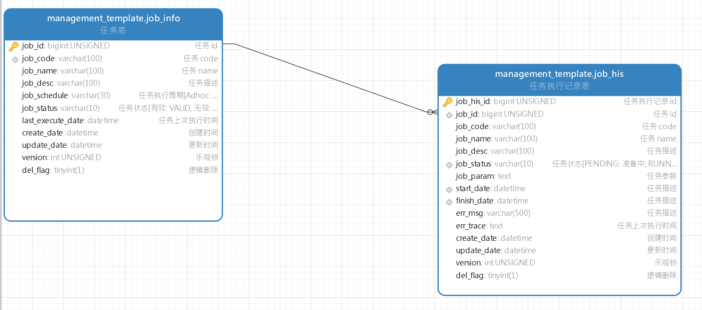

# ManagementSystemTemplate -- 管理系统模板(后端)

## 技术栈

- SpringBoot
- Mybatis & Mybatis Plus
- Spring doc & Swagger UI
- Redis
- MySQL & Oracle

## 模板实现功能

- [x] job 管理
- [x] 登录认证
- [x] 用户-角色-权限管理
- [x] 邮件发送
- [x] 短信发送
- [x] 验证码, 二维码生成
- [x] 文件管理
- [x] 文件管理多数据源支持(阿里云, 七牛云, 腾讯云, SM.MS, Local, DB)
- [x] Docker 构建, 包含环境&服务
- [x] Jenkins 构建

## 模块详情

### 登录认证实现


### Job 实现

> 简介

Job 模块主要用于实现管理项目的定时任务, 手动任务

Job 主要分为两类
- 定时 Job: 定时执行的 Job
- 手动 Job: 需手动执行的 Job, 此类 Job 也可以通过注解设定, 在项目启动后自动执行一次, 具体实现可参考 [InitializeRoleJob](src/main/java/com/yixihan/template/job/InitializeRoleJob.java)

> 相关表

- job_info: 记录 Job 的基础信息
- job_his: 记录 Job 的执行记录



> 相关类

- 接口 `Job` ([Job](src/main/java/com/yixihan/template/job/Job.java)): **用于定义 Job**, 共有如下几个方法
```java
// basic job info
String jobCode();
String jobName();
String jobDescription();
// job 执行周期, 文字化描述, 手动触发则置为 Manually
String jobSchedule();
// job 触发器, 此方法上写 定时注解. 代码则固定调用 JobRunner.runJob 方法
void execute();
// job 执行具体逻辑
void run(JobParam param);
```
- Job 执行入参 `JobParam` ([JobParam.java](src/main/java/com/yixihan/template/vo/req/job/JobParam.java)):  **用于定义 Job 执行参数**, 共有如下几个参数
```java
// 任务 code
private String jobCode;
// 任务执行时间
private Date jobExecuteDate;
// 其余参数, json 格式
private String details;
```
- 执行器 `JobRunner` ([JobRunner](src/main/java/com/yixihan/template/job/JobRunner.java)):  **用于执行 Job**, 共有如下几个方法
```java
// 执行 job, 不带 jobParam, 没有 job 执行参数的走这个方法
public void runJob(Job job);
// 执行 job, 带 jobParam, 有 job 执行参数的走这个方法, 走接口手动触发 job 也是走的这个方法
public void runJob(Job job, JobParam param);
```
- Job 状态枚举 `CommonStatusEnums` ([CommonStatusEnums](src/main/java/com/yixihan/template/common/enums/CommonStatusEnums.java)): **用于定义 Job 的状态**
- Job 执行结果枚举 `JobStatusEnums` ([JobStatusEnums](src/main/java/com/yixihan/template/common/enums/JobStatusEnums.java)): **用于定义 Job 的执行结果**
- JobHis 自动清理 Job `AutoCleanJobHisJob` ([AutoCleanJobHisJob](src/main/java/com/yixihan/template/job/AutoCleanJobHisJob.java)): **用于清理过于久远或过多的 Job 执行记录**
   - 超过 180 天的 JobHis
   - 单个 Job 执行记录超过 1w 条的 JobHis, 清理至 1w 条


#### Job 执行过程实现

首先需要明白. 无论哪类 Job, 触发 Trigger 是什么, 最终都会通过 `JobRunner.runJob` 去执行. 
1. Job 触发
   1. 手动触发: 触发方法为 `com.yixihan.template.service.job.impl.JobInfoServiceImpl.triggerJob` 方法, 该方法为手动调用, 经参数校验后, 获取 `Job` 类后直接调用 `JobRunner.runJob`
   2. 自动触发: 触发方法为 `com.yixihan.template.job.Job.execute` 方法. 该方法通过 `@Scheduled` 注解自动调用, 直接调用 `JobRunner.runJob`
2. 获取 `jobInfo` & 初始化 `jobHis`
   1. 首先通过 `Job.jobCode` 方法获取 `jobCode`, 然后去数据库里面 load `jobInfo`. 参考 `com.yixihan.template.job.JobRunner.getJobInfo`
      1. 若数据库中没有该 `jobCode`, 则会通过 `Job` 对象里面的信息, 初始化一个 `JobInfo` 对象, 然后入库
      2. 若数据库中有该 `jobCode`, 则直接从数据库中 load 该 `JobInfo`
      3. 判断该 `JobInfo` 的状态, 若为 Invalid, 则直接结束该 `Job` 的执行
   2. 然后通过 `JobInfo` 去初始化 `JobHis` 对象, 入库. 参考 `com.yixihan.template.job.JobRunner.initJobHis`
3. 设置该 Job 这一次触发的开始时间, 然后更新 `JobInfo` 和 `JobHis`
4. 调用 `Job.run` 方法去实际执行该 Job 的具体逻辑
5. 若 Job 执行成功, 更新 `JobHis` 的 `finishDate` & `jobStatus`, 最后入库
6. 若 Job 执行失败, 更新 `JobHis` 的 `jobStatus` & `errMsg` & `errTrace`, 最后入库

### 异常实现


###  